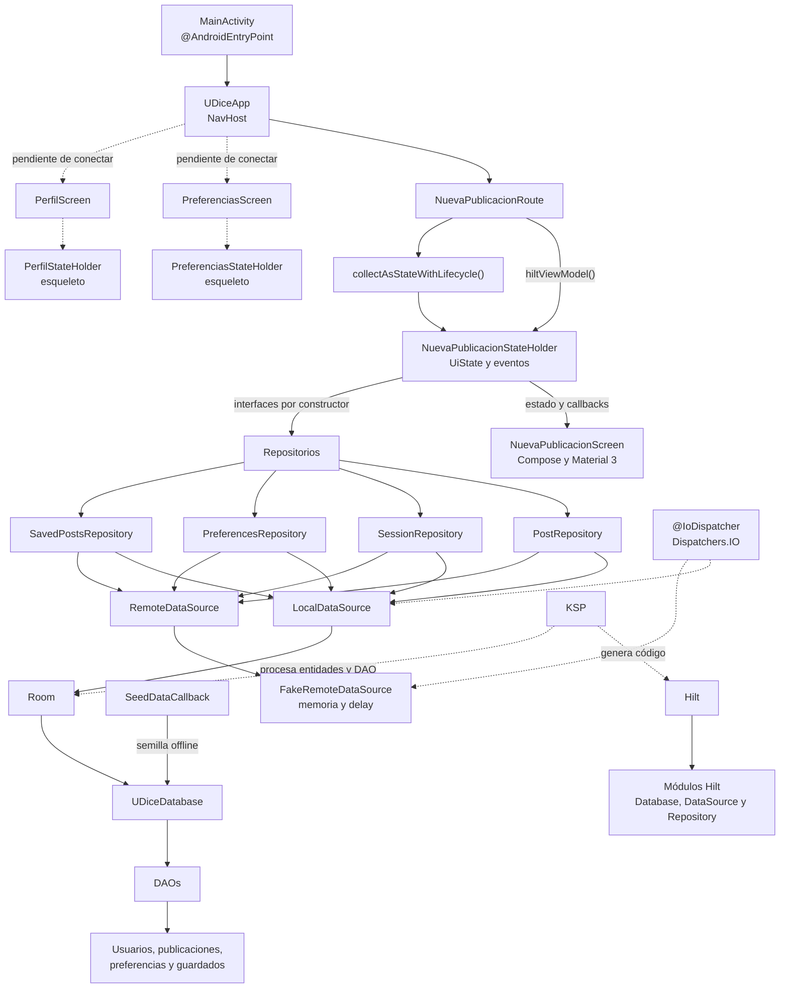

```mermaid
flowchart TD
    Main["MainActivity<br/>@AndroidEntryPoint"] --> Nav["UDiceApp<br/>NavHost"]

    Nav --> NewRoute["NuevaPublicacionRoute"]
    NewRoute -->|"hiltViewModel()"| NewHolder["NuevaPublicacionStateHolder<br/>UiState y eventos"]
    NewHolder -->|"estado y callbacks"| NewScreen["NuevaPublicacionScreen<br/>Compose y Material 3"]

    Nav -. "pendiente de conectar" .-> PrefScreen["PreferenciasScreen"]
    Nav -. "pendiente de conectar" .-> ProfileScreen["PerfilScreen"]
    PrefScreen -.-> PrefHolder["PreferenciasStateHolder<br/>esqueleto"]
    ProfileScreen -.-> ProfileHolder["PerfilStateHolder<br/>esqueleto"]

    NewHolder -->|"interfaces por constructor"| Repos["Repositorios"]

    Repos --> PostRepo["PostRepository"]
    Repos --> SessionRepo["SessionRepository"]
    Repos --> PreferencesRepo["PreferencesRepository"]
    Repos --> SavedPostsRepo["SavedPostsRepository"]

    PostRepo --> LocalDS["LocalDataSource"]
    SessionRepo --> LocalDS
    PreferencesRepo --> LocalDS
    SavedPostsRepo --> LocalDS

    PostRepo --> RemoteDS["RemoteDataSource"]
    SessionRepo --> RemoteDS
    PreferencesRepo --> RemoteDS
    SavedPostsRepo --> RemoteDS

    LocalDS --> Room["Room"]
    Room --> DB["UDiceDatabase"]
    DB --> DAO["DAOs"]
    DAO --> Tables["Usuarios, publicaciones,<br/>preferencias y guardados"]
    Seed["SeedDataCallback"] -->|"semilla offline"| DB

    RemoteDS --> Fake["FakeRemoteDataSource<br/>memoria y delay"]

    Hilt["Hilt"] --> Modules["Módulos Hilt<br/>Database, DataSource y Repository"]
    KSP["KSP"] -. "genera código" .-> Hilt
    KSP -. "procesa entidades y DAO" .-> Room

    Io["@IoDispatcher<br/>Dispatchers.IO"] -.-> LocalDS
    Io -.-> Fake

    NewRoute --> Lifecycle["collectAsStateWithLifecycle()"]
    Lifecycle --> NewHolder

```
