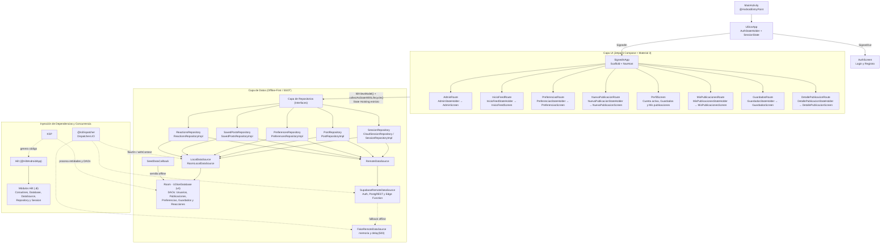

```mermaid
flowchart TD
    Main["MainActivity<br/>@AndroidEntryPoint"] --> App["UDiceApp<br/>AuthStateHolder + SessionState"]

    App -->|"SignedOut"| Auth["AuthScreen<br/>Login y Registro"]
    App -->|"SignedIn"| Nav["SignedInApp<br/>Scaffold + NavHost"]

    subgraph UI["Capa UI (Jetpack Compose + Material 3)"]
        Nav --> AdminR["AdminRoute<br/>AdminStateHolder → AdminScreen"]
        Nav --> FeedR["InicioFeedRoute<br/>InicioFeedStateHolder → InicioFeedScreen"]
        Nav --> PrefR["PreferenciasRoute<br/>PreferenciasStateHolder → PreferenciasScreen"]
        Nav --> NewR["NuevaPublicacionRoute<br/>NuevaPublicacionStateHolder → NuevaPublicacionScreen"]
        Nav --> PerfS["PerfilScreen<br/>Cuenta activa, Guardados y Mis publicaciones"]
        Nav --> MisR["MisPublicacionesRoute<br/>MisPublicacionesStateHolder → MisPublicacionesScreen"]
        Nav --> GuardR["GuardadosRoute<br/>GuardadosStateHolder → GuardadosScreen"]
        Nav --> DetR["DetallePublicacionRoute<br/>DetallePublicacionStateHolder → DetallePublicacionScreen"]
    end

    UI -->|"hiltViewModel() + collectAsStateWithLifecycle()<br/>State Hoisting estricto"| Repos["Capa de Repositorios (Interfaces)"]

    subgraph DATA["Capa de Datos (Offline-First / SSOT)"]
        Repos --> SessionRepo["SessionRepository<br/>CloudSessionRepository / SessionRepositoryImpl"]
        Repos --> PostRepo["PostRepository<br/>PostRepositoryImpl"]
        Repos --> PrefRepo["PreferencesRepository<br/>PreferencesRepositoryImpl"]
        Repos --> SavedRepo["SavedPostsRepository<br/>SavedPostsRepositoryImpl"]
        Repos --> ReactRepo["ReactionsRepository<br/>ReactionsRepositoryImpl"]

        SessionRepo --> LocalDS["LocalDataSource<br/>RoomLocalDataSource"]
        PostRepo --> LocalDS
        PrefRepo --> LocalDS
        SavedRepo --> LocalDS
        ReactRepo --> LocalDS

        SessionRepo --> RemoteDS["RemoteDataSource"]
        PostRepo --> RemoteDS
        PrefRepo --> RemoteDS
        SavedRepo --> RemoteDS
        ReactRepo --> RemoteDS

        LocalDS --> DB["Room · UDiceDatabase (v4)<br/>DAOs: Usuarios, Publicaciones,<br/>Preferencias, Guardados y Reacciones"]
        Seed["SeedDataCallback"] -->|"semilla offline"| DB

        RemoteDS --> Supa["SupabaseRemoteDataSource<br/>Auth, PostgREST y Edge Function"]
        Supa -. "fallback offline" .-> Fake["FakeRemoteDataSource<br/>memoria y delay(500)"]
    end

    subgraph DI["Inyección de Dependencias y Concurrencia"]
        Hilt["Hilt (@HiltAndroidApp)"] --> Modules["Módulos Hilt (.di)<br/>Coroutines, Database, DataSource,<br/>Repository y Session"]
        KSP["KSP"] -. "genera código" .-> Hilt
        KSP -. "procesa entidades y DAOs" .-> DB
        Io["@IoDispatcher<br/>Dispatchers.IO"] -. "flowOn / withContext" .-> LocalDS
        Io -.-> Supa
        Io -.-> Fake
    end
```
